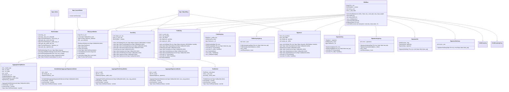

```mermaid
classDiagram

class BlstTsAddon{
  + std::string _dst
  + std::string _blst_error_strings[8]
  + Napi::FunctionReference _secret_key_ctr
  + napi_type_tag _secret_key_tag
  + Napi::FunctionReference _public_key_ctr
  + napi_type_tag _public_key_tag
  + Napi::FunctionReference _signature_ctr
  + napi_type_tag _signature_tag
  + BlstTsAddon(Napi::Env env, Napi::Object exports)
  + std::string GetBlstErrorString(const blst::BLST_ERROR &err)
  + bool GetRandomBytes(blst::byte *ikm, size_t length)
  + Napi::Value RunTest(const Napi::CallbackInfo &info)
  - Napi::Object BuildJsConstants(Napi::Env &env)
}

class BlstBase{
  + bool IsZeroBytes(const uint8_t *data, size_t start_byte, size_t byte_length)
  + bool HasError()
  + std::string GetError()
  + size_t GetBadIndex()
  + void ThrowJsException()
  # BlstBase(Napi::Env env)
  # void SetError(const std::string &err, const size_t bad_index = 0)
  # Napi::Env _env
  # BlstTsAddon *_module
  # std::string _error
  # size_t _bad_index
}

class Napi_AsyncWorker{
  + virtual void Execute()
}

class BlstAsyncWorker{
  + BlstAsyncWorker(const Napi::CallbackInfo &info)
  + Napi::Value RunSync()
  + Napi::Value Run()
  # Napi::Env &_env
  # const Napi::CallbackInfo &_info
  # virtual void Setup()
  # virtual Napi::Value GetReturnValue()
  # void SetError(const std::string &err)
  # void OnOK()
  # void OnError(Napi::Error const &err)
  - Napi::Promise::Deferred _deferred
  - bool _use_deferred
  - Napi::Promise GetPromise()
}

class SecretKey{
  + std::unique_ptr<blst::SecretKey> _key
  + bool _is_zero_key
  + static void Init(Napi::Env env, Napi::Object &exports, BlstTsAddon *module)
  + static Napi::Value FromKeygen(const Napi::CallbackInfo &info)
  + static Napi::Value FromKeygenSync(const Napi::CallbackInfo &info)
  + static Napi::Value Deserialize(const Napi::CallbackInfo &info)
  + SecretKey(const Napi::CallbackInfo &info)
  + Napi::Value Serialize(const Napi::CallbackInfo &info)
  + Napi::Value ToPublicKey(const Napi::CallbackInfo &info)
  + Napi::Value Sign(const Napi::CallbackInfo &info)
  + Napi::Value SignSync(const Napi::CallbackInfo &info)
  - BlstTsAddon *_module
}

class PublicKey{
  + bool _is_zero_key
  + bool _has_jacobian
  + bool _has_affine
  + std::unique_ptr<blst::P1> _jacobian
  + std::unique_ptr<blst::P1_Affine> _affine
  + static void Init(Napi::Env env, Napi::Object &exports, BlstTsAddon *module)
  + static Napi::Value Deserialize(const Napi::CallbackInfo &info)
  + PublicKey(const Napi::CallbackInfo &info)
  + Napi::Value Serialize(const Napi::CallbackInfo &info)
  + Napi::Value KeyValidate(const Napi::CallbackInfo &info)
  + Napi::Value KeyValidateSync(const Napi::CallbackInfo &info)
  + const blst::P1 *AsJacobian()
  + const blst::P1_Affine *AsAffine()
  + bool NativeValidate()
}

class PublicKeyArg{
  + PublicKeyArg(Napi::Env env)
  + PublicKeyArg(Napi::Env env, Napi::Value raw_arg)
  + const blst::P1 *AsJacobian()
  + const blst::P1_Affine *AsAffine()
  + bool NativeValidate()
  + const uint8_t *GetBytes()
  + size_t GetBytesLength()
  - PublicKey *_public_key
  - Uint8ArrayArg _bytes
  - Napi::Reference<Napi::Object> _ref
}

class PublicKeyArgArray{
  + PublicKeyArgArray(Napi::Env env, Napi::Value raw_arg)
  + PublicKeyArg &operator[](size_t index)
  + size_t Size()
  + void Reserve(size_t size)
  - std::vector<PublicKeyArg> _keys
}

class Signature{
  + bool _has_jacobian
  + bool _has_affine
  + std::unique_ptr<blst::P2> _jacobian
  + std::unique_ptr<blst::P2_Affine> _affine
  + static void Init(Napi::Env env, Napi::Object &exports, BlstTsAddon *module)
  + static Napi::Value Deserialize(const Napi::CallbackInfo &info)
  + Signature(const Napi::CallbackInfo &info)
  + Napi::Value Serialize(const Napi::CallbackInfo &info)
  + Napi::Value SigValidate(const Napi::CallbackInfo &info)
  + Napi::Value SigValidateSync(const Napi::CallbackInfo &info)
  + const blst::P2 *AsJacobian()
  + const blst::P2_Affine *AsAffine()
}

class SignatureArg{
  + Signature *_signature
  + SignatureArg(Napi::Env env)
  + SignatureArg(Napi::Env env, Napi::Value raw_arg)
  + const blst::P2 *AsJacobian()
  + const blst::P2_Affine *AsAffine()
  - Uint8ArrayArg _bytes
  - Napi::Reference<Napi::Value> _ref
}

class SignatureArgArray{
  + SignatureArgArray(Napi::Env env, Napi::Value raw_arg)
  + SignatureArg &operator[](size_t index)
  + size_t Size()
  + void Reserve(size_t size)
  - std::vector<SignatureArg> _signatures
}


  class AggregateVerifyWorker {
    + AggregateVerifyWorker(const Napi::CallbackInfo &info)
    # void Setup() override
    # void Execute() override
    + Napi::Value GetReturnValue() override
    - bool _invalid_args
    - bool _no_keys
    - bool _no_msgs
    - bool _result
    - std::unique_ptr<blst::Pairing> _ctx
    - Uint8ArrayArgArray _msgs
    - PublicKeyArgArray _public_keys
    - SignatureArg _signature
  }

  class SignatureSet {
    - Uint8ArrayArg _msg
    - PublicKeyArg _publicKey
    - SignatureArg _signature
    + SignatureSet(Napi::Env env, const Napi::Value &raw_arg)
  }

  class SignatureSetArray {
    - std::vector<SignatureSet> _sets
    + SignatureSetArray(Napi::Env env, const Napi::Value &raw_arg)
  }

  class VerifyMultipleAggregateSignaturesWorker {
    + VerifyMultipleAggregateSignaturesWorker(const Napi::CallbackInfo &info)
    # void Setup() override
    # void Execute() override
    + Napi::Value GetReturnValue() override
    - bool _result
    - std::unique_ptr<blst::Pairing> _ctx
    - SignatureSetArray _sets
  }

  class AggregatePublicKeysWorker {
    + AggregatePublicKeysWorker(const Napi::CallbackInfo &info, size_t arg_position)
    # void Setup() override
    # void Execute() override
    + Napi::Value GetReturnValue() override
    - bool _is_valid
    - blst::P1 _result
    - PublicKeyArgArray _public_keys
  }

  class AggregateSignaturesWorker {
    + AggregateSignaturesWorker(const Napi::CallbackInfo &info, size_t arg_position)
    # void Setup() override
    # void Execute() override
    + Napi::Value GetReturnValue() override
    - bool _is_valid
    - blst::P2 _result
    - SignatureArgArray _signatures
  }

  class TestWorker {
    + TestWorker(const Napi::CallbackInfo &info)
    # void Setup() override
    # void Execute() override
    + Napi::Value GetReturnValue() override
    - TestPhase _test_phase
    - int32_t _test_case
    - std::string _return_value
  }

Napi_Addon --|> BlstTsAddon
BlstBase --|> BlstAsyncWorker
Napi_AsyncWorker --|> BlstAsyncWorker

BlstBase --|> Uint8ArrayArg
BlstBase --|> Uint8ArrayArgArray

BlstBase --|> SecretKey
Napi_ObjectWrap --|> SecretKey

BlstBase --|> PublicKey
Napi_ObjectWrap --|> PublicKey
BlstBase --|> PublicKeyArg
BlstBase --|> PublicKeyArgArray

BlstBase --|> Signature
Napi_ObjectWrap --|> Signature
BlstBase --|> SignatureArg
BlstBase --|> SignatureArgArray

BlstAsyncWorker --|> AggregateVerifyWorker 
BlstAsyncWorker --|> VerifyMultipleAggregateSignaturesWorker 
BlstAsyncWorker --|> AggregatePublicKeysWorker 
BlstAsyncWorker --|> AggregateSignaturesWorker 
BlstAsyncWorker --|> TestWorker 
BlstBase --|> SignatureSet 
BlstBase --|> SignatureSetArray 
```
