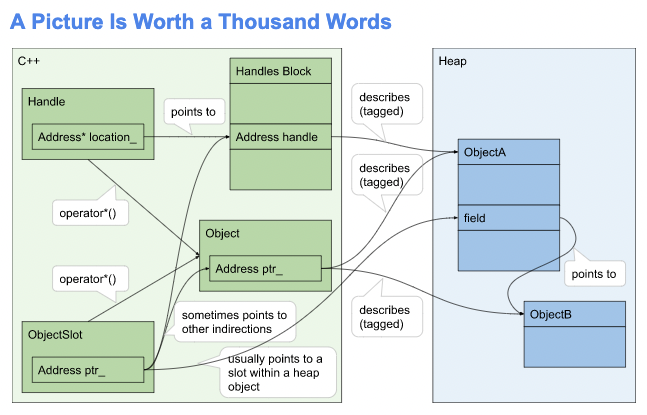

# JavaScript Values Under-the-Hood

_**note:** If you followed the development of this file you may have noticed that it took a very long time to write and changed during writing.  There is a lot of inconsistency in the writings surrounding [`HandleScope`](https://github.com/nodejs/node-addon-api/blob/main/doc/handle_scope.md)._ _I built the code using what I read so it "works correctly" but at the time I had no idea why, nor how._ _To try an explain it better I read what was available and wrote about it._ _I realized it didn't "make sense."_ _So I read through the `node` source to try and figure it out but there is a TON of code that makes "values work."_ _I revised this document a couple times during the process as my understanding evolved._ _I think this is how it works but have [requested a review]() from the V8 team to make sure its correct._ _I also want to hightlight this body of work in hopes it, or parts of it, may be added to the [official documentation](https://github.com/nodejs/node-addon-api/tree/main/doc) or the [examples repo](https://github.com/nodejs/node-addon-examples) to move the content up the open-source tree where it will be more visible to the broader community._

---

There is a paradigm shift native addon developers must undergo to really grok how JavaScript values exist under the hood.  The JS runtime is a running application and we can use a runtime API to access JS values.  Data backing the values [exists on the heap](https://github.com/nodejs/node/blob/4166d40d0873b6d8a0c7291872c8d20dc680b1d7/deps/v8/src/objects/objects-inl.h#L445) regardless if the value is "stack" or "heap" allocated from a JS perspective. When working with a `napi_value` we are working with "references" to pointers to the heap data. Here is a picture taken from [this](https://docs.google.com/document/d/1_w49sakC1XM1OptjTurBDqO86NE16FH8LwbeUAtrbCo/edit#heading=h.8wg7tpqbpt7m) document from the current v8 design.



That heap data is managed by the JS engine, which means that the data is MOVED by the engine without notice. It is also actively cleaned up by the almighty garbage collector. This is a process that can be fraught for native code because it runs outside of the JS context.

Because data is heap allocated, values provide two functions.  They facilitate lookup and garbage collection and there are two different systems for accomplishing that.  `v8::Context` is what [creates](./environment.md#) lexical context.  `internal::v8::Object` [doclink](https://github.com/nodejs/node/blob/4166d40d0873b6d8a0c7291872c8d20dc680b1d7/deps/v8/src/objects/objects.h#L299) and handles to those objects allow the runtime to function with data that moves.

You can find the full inheritance hierarchy [here](./reference.md#object-inheritance-hierarchy), but pay attention to the following section as it will help to understand how `HandleScope` and `napi_value`  relate.

```c++
// - Object
//   - Smi          (immediate small integer)
//   - TaggedIndex  (properly sign-extended immediate small integer)
//   - HeapObject   (superclass for everything allocated in the heap)
//     - JSReceiver  (suitable for property access) ie. Object/Proxy
//     - FixedArrayBase  (superclass for BufferLike and hash-table based data)
//     - PrimitiveHeapObject  (primitives String/Symbol/Number)
```

The `Isolate` is responsible for handling all data related to JS execution and values are only the slice that addon developers interact with.  Memory is allocated in the heap to manage all things JS and native code handles  are references, to pointers, to said data.

When working with `napi_value`, and by extension `Napi::Value`, it is important to pass by value.  While it is possible to also pass by reference, which is glorified pass by value, one should never pass by pointer. That insinuates some form of heap allocation for the `napi_value` and the value is not properly counted in the references because of the extra level of indirection.

It is important to note that `v8::Object` and a JavaScript `Object` are not the same. In a JS script, `new Object` creates an instance of `JSObject` under-the-hood and that is a subclass of `JSReceiver`.

The isolate creates objects during runtime and they will be stored in the faster to access space. The runtime will retain a `Handle` to the data so values can be looked up. The `Handle` will be added to, and managed by, the nearest `HandleScope` so that the GC can cleanup once the `HandleScope` is destroyed (variable goes out of scope lexically).
When the GC runs over the fast access space, any objects that are still relevant are [assigned storage](https://github.com/nodejs/node/blob/4166d40d0873b6d8a0c7291872c8d20dc680b1d7/deps/v8/src/objects/objects.h#L378) by the `Isolate` in the slower to access space.

Values, `napi_value` for the rest of this document will be referred to as Value, and similarly a `v8::Object` will also be referred to simply as Object, will remain in scope for as long as the native function is on the stack.  When the garbage collector runs (at some point, but assume) while a function is somewhere on the stack, all referenced objects on the stack that are not already moved, will be moved with longer-lived variables. This is why pointing to the underlying data directly is not a great idea and patterns explained below were developed.

## Napi Values

There is only a subset of Object types that are exposed to the native addon layer, JS values being the most important. The base type that all other types extend is the `napi_value` or `Napi::Value`. There is also the idea of `Napi::Maybe` floating above that, but that topic is out of scope for this discussion.  For all intensive purposes, when you ask the engine for some data, it will return a value.  It is then the job of the implementer to suss out what type of value it is and then to convert it to the underlying, and actually useful, data that system level code can interpret.

I will let a segment from the `node-addon-api` speak for itself...

```c++
/// A JavaScript value of unknown type.
///
/// For type-specific operations, convert to one of the Value subclasses using a
/// `To*` or `As()` method. The `To*` methods do type coercion; the `As()`
/// method does not.
///
///     Napi::Value value = ...
///     if (!value.IsString()) throw Napi::TypeError::New(env, "Invalid
///     arg..."); Napi::String str = value.As<Napi::String>(); // Cast to a
///     string value
///
///     Napi::Value anotherValue = ...
///     bool isTruthy = anotherValue.ToBoolean(); // Coerce to a boolean value
class Value {
 public:
  Value();  ///< Creates a new _empty_ Value instance.
  Value(napi_env env,
        napi_value value);  ///< Wraps a Node-API value primitive.

  /// Creates a JS value from a C++ primitive.
  ///
  /// `value` may be any of:
  /// - bool
  /// - Any integer type
  /// - Any floating point type
  /// - const char* (encoded using UTF-8, null-terminated)
  /// - const char16_t* (encoded using UTF-16-LE, null-terminated)
  /// - std::string (encoded using UTF-8)
  /// - std::u16string
  /// - napi::Value
  /// - napi_value
  template <typename T>
  static Value From(napi_env env, const T& value);

  /// Converts to a Node-API value primitive.
  ///
  /// If the instance is _empty_, this returns `nullptr`.
  operator napi_value() const;

  /// Gets the environment the value is associated with.
  Napi::Env Env() const;

  /// Checks if the value is empty (uninitialized).
  ///
  /// An empty value is invalid, and most attempts to perform an operation on an
  /// empty value will result in an exception. Note an empty value is distinct
  /// from JavaScript `null` or `undefined`, which are valid values.
  ///
  /// When C++ exceptions are disabled at compile time, a method with a `Value`
  /// return type may return an empty value to indicate a pending exception. So
  /// when not using C++ exceptions, callers should check whether the value is
  /// empty before attempting to use it.
  bool IsEmpty() const;

  napi_valuetype Type() const;  ///< Gets the type of the value.

  bool IsUndefined() const;   ///< Tests if a value is an undefined JavaScript value.
  bool IsNull() const;        ///< Tests if a value is a null JavaScript value.
  bool IsBoolean() const;     ///< Tests if a value is a JavaScript boolean.
  bool IsNumber() const;      ///< Tests if a value is a JavaScript number.
  bool IsBigInt() const;      ///< Tests if a value is a JavaScript bigint.
  bool IsDate() const;        ///< Tests if a value is a JavaScript date.
  bool IsString() const;      ///< Tests if a value is a JavaScript string.
  bool IsSymbol() const;      ///< Tests if a value is a JavaScript symbol.
  bool IsArray() const;       ///< Tests if a value is a JavaScript array.
  bool IsArrayBuffer() const; ///< Tests if a value is a JavaScript array buffer.
  bool IsTypedArray() const;  ///< Tests if a value is a JavaScript typed array.
  bool IsObject() const;      ///< Tests if a value is a JavaScript object.
  bool IsFunction() const;    ///< Tests if a value is a JavaScript function.
  bool IsPromise() const;     ///< Tests if a value is a JavaScript promise.
  bool IsDataView() const;    ///< Tests if a value is a JavaScript data view.
  bool IsBuffer() const;      ///< Tests if a value is a Node buffer.
  bool IsExternal() const;    ///< Tests if a value is a pointer to external data.

  /// Casts to another type of `Napi::Value`, when the actual type is known or
  /// assumed.
  ///
  /// This conversion does NOT coerce the type. Calling any methods
  /// inappropriate for the actual value type will throw `Napi::Error`.
  template <typename T>
  T As() const;

  MaybeOrValue<Boolean> ToBoolean() const;  ///< Coerces a value to a JavaScript boolean.
  MaybeOrValue<Number> ToNumber() const;  ///< Coerces a value to a JavaScript number.
  MaybeOrValue<String> ToString() const;  ///< Coerces a value to a JavaScript string.
  MaybeOrValue<Object> ToObject() const;  ///< Coerces a value to a JavaScript object.

 protected:
  napi_env _env;
  napi_value _value;
};
```

So back to the part about requesting values. In order to access JavaScript values, the executing code must be on the JS thread. A challenge presents itself because one of the most important reasons for writing node addons is to circumvent the limitations of strictly staying on thread. When working with the JS data off thread there are provisions that need to be made so that the data is accessible.

## How to Use the Data Backing Values

There are a few ways to do this with the simplest being copy it.  A quick `memcpy` or assignment to another variable, while on the thread, will allow that data to be used after leaving the JS context.  One simply asks `v8` for the value, saves it to a class member somewhere and off we go.  That is totally valid for some cases, but in others it's SLOW...

The two ends of the spectrum of copy vs. point are primitives and buffers. They are the simplest to work with. For primitive values, pointing to the data is a bad idea, because it moves, so copying is the correct approach.  With buffers, the `BackingStore` is [allocated](https://github.com/nodejs/node/blob/4166d40d0873b6d8a0c7291872c8d20dc680b1d7/deps/v8/src/objects/backing-store.cc#L240) using a normal [malloc/calloc](https://github.com/nodejs/node/blob/4166d40d0873b6d8a0c7291872c8d20dc680b1d7/deps/v8/src/api/api.cc#L393).  This means that it will not move as long as it is not [resized](https://github.com/nodejs/node/blob/4166d40d0873b6d8a0c7291872c8d20dc680b1d7/deps/v8/src/api/api.cc#L401).

Where it gets a bit more complicated is complex types. The underlying data is not stored contiguously like in native `struct` or `array`. It is necessary to use the `Isolate`, like when working in a JS file, to resolve the leaf node Objects.  Once at the leaf node, apply the rules above for primitives and buffers.

## Protecting Data from Garbage Collection

In order to notify the `Isolate` that a value is still relevant, one must reference the data. There are [two types](https://github.com/nodejs/node/blob/4166d40d0873b6d8a0c7291872c8d20dc680b1d7/deps/v8/include/v8-local-handle.h#L136) of handles in node, local and persistent. Local are lexically driven references, ie the data is still in scope, and persistent references can be used when storing objects across several independent operations. They have to be explicitly created and de-allocated if no longer used.

## `v8::HandleScope` and `Napi::HandleScope`

Lexical references are manged by the `HandleScope`, a stack-allocated class that governs a number of local handles. After a handle scope has been created, all local handles will be allocated within that handle scope until either the handle scope is deleted or another handle scope is created.  If there is already a handle scope and a new one is created, all allocations will take place in the new handle scope until it is deleted.  After that, new handles will again be allocated in the original handle scope. After the handle scope of a local handle has been deleted the garbage collector will no longer track the object stored in the handle and may deallocate it.  The behavior of accessing a handle for which the handle scope has been deleted is undefined.

A `v8::HandleScope` represents a [block of memory](https://github.com/nodejs/node/blob/4166d40d0873b6d8a0c7291872c8d20dc680b1d7/deps/v8/include/v8-local-handle.h#L111-L113) in the `Isolate`-managed heap and there is only ever one active `HandleScope` at a time.  The active scope is tracked in [here](https://github.com/nodejs/node/blob/4166d40d0873b6d8a0c7291872c8d20dc680b1d7/deps/v8/src/execution/isolate.h#L2212) in the `Isolate->handle_scope_data_`. When a scope is deleted, the handles in the block will stop being tracked, and the previous scope will be restored from the saved `prev_next_` and `prev_limit_` pointers.

## The Reference System

The `Reference` system is used for non-lexically-based data persistance. There are several `Reference` types available to us, and we will talk a bit about them all. As a note, they are the second inheritance hierarchy in the `Napi` namespace, with the first being `Value`s.

```c++
// Holds a counted reference to a value; initially a weak reference unless
// otherwise specified, may be changed to/from a strong reference by adjusting
// the refcount.
//
// The referenced value is not immediately destroyed when the reference count
// is zero; it is merely then eligible for garbage-collection if there are no
// other references to the value.
//
// Note when getting the value of a Reference it is usually correct to do so
// within a HandleScope so that the value handle gets cleaned up efficiently.
  
template <typename T>
class Reference {}

class ObjectReference : public Reference<Object> {}
class FunctionReference : public Reference<Function> {}
class Error : public ObjectReference {}
class TypeError : public Error {}
class RangeError : public Error {}

// Shortcuts to creating a new reference with inferred type and refcount = 0.
template <typename T>
Reference<T> Weak(T value);
ObjectReference Weak(Object value);
FunctionReference Weak(Function value);

// Shortcuts to creating a new reference with inferred type and refcount = 1.
template <typename T>
Reference<T> Persistent(T value);
ObjectReference Persistent(Object value);
FunctionReference Persistent(Function value);
```

### Persistent vs Weak References

All references are initially created with a ref count of `0`.  This is a `Weak` reference.  When the ref count is `0` the value is eligible for garbage collection.  Increasing the ref count greater than `0` will result in a `Persistent` reference.  This means that the value will not be eligible garbage collection until the reference is deleted.

### SuppressDestruct

### Errors are References?

Yes.  When a `Napi::Error` is created it is creating a JS `Error` under the hood and what is returned to the native code is a `Persistent` reference to the JS `Error` object.

### `ObjectReference` and `FunctionReference`

There are two specialized types of references that allow more functionality than a base `Reference`.  They are `ObjectReference` and `FunctionReference`.  They are used to